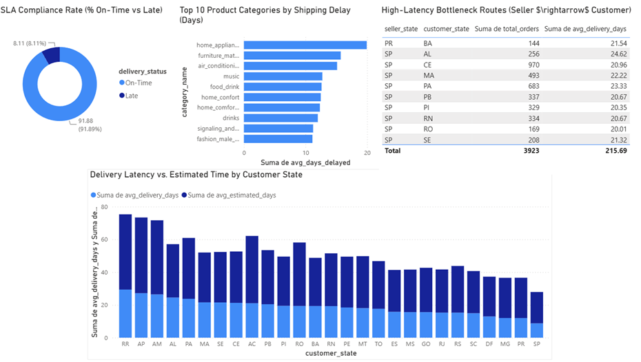

# Olist E-Commerce Supply Chain & Delivery Performance Analysis

## Executive Summary
This project analyzes the logistics and supply chain operations of **Olist**, the largest e-commerce department store marketplace in Brazil. Utilizing a database of **100k+ orders** spanning from 2016 to 2018, this study isolates operational bottlenecks, evaluates delivery Service Level Agreement (SLA) compliance, and quantifies the impact of seller-to-customer geographical dispersion on fulfillment speed.

## Business Problem & Objectives
Logistics performance directly impacts customer satisfaction and retention in e-commerce platforms. The primary goals of this project are:
1. **SLA Compliance Analysis**: Determine the proportion of orders delivered on time versus past the estimated delivery date.
2. **Geographical Bottleneck Identification**: Identify Brazilian states and routes experiencing the longest lead times.
3. **Category-Level Friction**: Isolate product categories associated with severe shipping delays.
4. **Actionable Recommendations**: Provide data-driven strategy proposals to optimize fulfillment routes and seller placement.

## Data Architecture & Tech Stack
* **Database Engine**: SQLite 3 (production-grade embedded database)
* **SQL Environment**: Visual Studio Code with SQLite Tools & Extensions
* **ETL Pipeline**: Python (`pandas`, `sqlite3`, `glob`) for automated CSV ingestion and schema definition
* **Visualization & BI**: Power BI connected natively to `olist.db`

### Project Directory Structure
```text
olist-ecommerce-supply-chain-sql/
├── data/                             # Raw CSV datasets from Olist
├── sql/                              # Production SQL analytical scripts
│   └── 01_logistics_analysis.sql    # SLA, lead times, and route queries
├── build_database.py                 # Automated ETL & database builder
├── olist.db                          # Generated SQLite database file
├── README.md                         # Project documentation
└── .gitignore                        # Git exclusion rules
```


## Key Business Insights & Findings

### 1. Regional Shipping Latency (Query 1)
* **Severe Delivery Disparity:**  Lead times range from 8.76 days in São Paulo (SP) up to 29.39 days in Roraima (RR).   
* **Extreme Northern Latency:** Remote states suffer the highest transit times despite low volume—RR (29.39 days, 41 orders), AP (27.19 days, 67 orders), and AM (26.43 days, 145 orders).  
* **Massive Volume Hubs:**  Over 50,000 orders are concentrated in SP (40,494 orders) and RJ (12,350 orders), maintaining significantly lower lead times of 8.76 and 15.31 days respectively. 

### 2. SLA Compliance & On-Time Performance (Query 2)
* **Strong Overall SLA Compliance:** 91.88% of all delivered orders arrive on or before the estimated target date (88,644 orders).   
* **Systemic Delivery Breaches:**   8.11% of orders breach SLA guidelines (7,826 orders), representing a significant absolute volume of delayed customer deliveries across the platform. 

### 3. High-Delay Product Categories (Query 3)
* **Worst Category Lag:**  home_appliances_2 suffers the highest delay severity, exceeding promised SLAs by nearly 20 days (19.93 days) on average. 
* **Heavy & Bulky Goods Friction:** Categories involving larger physical dimensions—such as furniture_mattress_and_upholstery (15.71 days) and air_conditioning (15.12 days)—experience severe post-SLA delays.   
* **Niche Category Bottlenecks:** Delays are concentrated in low-volume, specialized categories, indicating potential freight handling and specialized courier constraints rather than general order volume issues.  

### 4. Cross-State Bottleneck Routes (Query 4)
* **SP Seller Dominance:** 9 out of the top 10 worst-performing routes originate from sellers in São Paulo (SP).
* **Highest Route Latency:** The corridor SP -> AL is the slowest high-volume route, taking 24.62 days on average across 256 orders.
* **High-Volume Bottlenecks:**  Long-distance routes with heavy demand—such as SP -> CE (970 orders, 20.96 days) and SP -> PA (683 orders, 23.33 days)—suffer persistent lead times exceeding 20+ days.

 


## 📊 Supply Chain Dashboard

